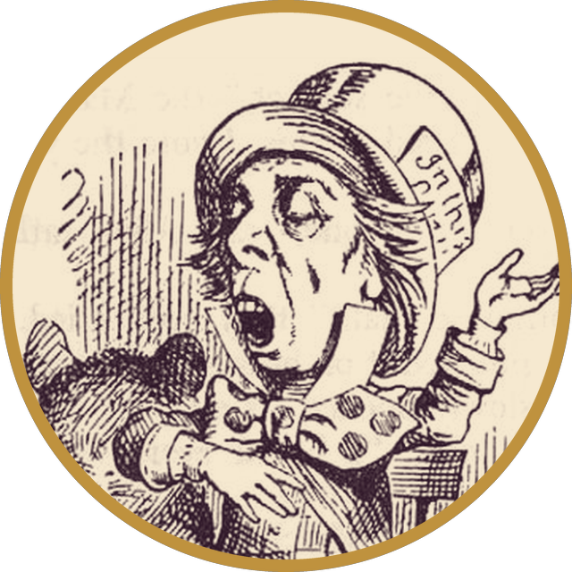

  

  

  <em>“I never saved anything for the swim back.”</em> 
  — Vincent, <strong>Gattaca</strong> (1997)

 

<table>
<tr>
<td width="34%" align="center" valign="middle">

<em>“Why is a raven like a writing-desk?”</em> still working on it.

</td>
<td width="66%" valign="top">

### 🎩 Hello, I'm Kinga

**Computer vision • 3D vision • model surgery • research agents**

👁️ I work on **keypoints, feature matching and geometry**: DLT calibration, LoFTR-style matchers, distilling big models into small ones that run on edge hardware.

🔪 I like opening models up: pruning, ablating, forking them and watching what breaks.

🤖 I build **autonomous research loops** that read papers overnight, find gaps, queue experiments on the **Euler** cluster and have a journal on my desk by 5 am.

🧩 I collect unsolved riddles (see **ARC-AGI**).

🫖 Tea is always on. It's always six o'clock here.

</td>
</tr>
</table>

## 🫖 The Tea Party · projects

<table>
<tr>
<td width="50%" valign="top">

<h3>🔪 <a href="https://github.com/Kiwiaw/model_surgery">forkpoint</a></h3>

**Visual model surgery for CNNs.** Load a PyTorch model, see its weights as visual mass, click a layer, ablate it, fork the model, and diff what changed: in the prediction *and* on the graph.

</td>
<td width="50%" valign="top">

<h3>📐 <a href="https://github.com/Kiwiaw/dlt_with_optimisation">DLT with optimisation</a></h3>

Camera calibration from scratch: **Direct Linear Transform** with Hartley normalisation and non-linear refinement. Just Python and NumPy, no black boxes.

</td>
</tr>
<tr>
<td width="50%" valign="top">

<h3>🐦‍⬛ <a href="https://github.com/Kiwiaw/arcAgi">ARC-AGI</a></h3>

Playing with the **Abstraction and Reasoning Corpus**: tiny grid puzzles that humans solve at a glance and machines still find maddening.

</td>
<td width="50%" valign="top">

<h3>🧊 <a href="https://github.com/Kiwiaw/FridgeApp">FridgeApp</a></h3>

Full-stack **React Native + Node.js + MongoDB** app for keeping track of what's in the fridge before it becomes a science project.

</td>
</tr>
</table>

<strong>🕰️ Currently brewing (private, for now)</strong>

 

- **keypoint-gap-agent**: autonomous gap hunter for keypoint detectors on edge hardware. Cloud agents scan the literature every evening; Euler jobs run the experiments overnight.
- **geo-loftr-KD**: knowledge distillation for geometry-aware LoFTR matching.

## 🧰 In my hat

  
  
  
  
  
   
  
  
  
  
  
  

## 🐍 Down the rabbit hole

  <picture>
    <source media="(prefers-color-scheme: dark)" srcset="https://raw.githubusercontent.com/Kiwiaw/Kiwiaw/output/snake-dark.svg">
    
  </picture>

 

  
  <!-- add yours:
  
  
  -->

  🎩 <em>“We're all mad here.”</em> · Hatter illustration by John Tenniel (1865), public domain

