  

  

  <em>“I never saved anything for the swim back.”</em> 
  — Vincent, <strong>Gattaca</strong> (1997) · <a href="https://www.youtube.com/watch?v=GM-znjDGubE&t=218s">▶ watch with sound</a>

 

<table>
<tr>
<td width="34%" align="center" valign="middle">

<em>“Why is a raven like a writing-desk?”</em> still working on it.

</td>
<td width="66%" valign="top">

### Hello, I'm Kinga

**Computer vision researcher · BSc Computer Science & Engineering, TU Delft**

**ETH Zürich, Computer Vision and Geometry Group** (Prof. Marc Pollefeys) — research intern since July 2026, supervised by Philipp Lindenberger. I work on keypoint detection and uncertainty for more reliable camera pose estimation, building on the group's **RaCo** detector (3DV 2026): a new training objective for a learned detector, evaluated on HPatches, MegaDepth, ScanNet and ETH3D on the **Euler** cluster. Preprint in preparation.

**ESA ESTEC, GNC section** (Apr–Jun 2026) — cross-modal feature matching, event camera to optical imagery, for terrain-relative navigation in lunar landings. Test scenarios built in the PANGU simulator.

**Scaled Autonomy** (Dec 2025–Jun 2026) — drone-to-satellite image registration for GPS-denied flight: LoFTR and Fourier–Mellin matching, 4× the baseline inlier ratio on real flight data.

**TU Delft** — CSE bachelor, multimedia variant (computer vision and ML), GPA 8.0. Real-time multi-camera 3D drone tracking, licence-plate recognition, part-time ML engineer at Dream Team Epoch, former board member of the debating club.

I left school early to teach myself maths and CS, and got into TU Delft through an independent entrance exam. I like opening models up and watching what breaks. Tea is always on.

</td>
</tr>
</table>

## 🫖 The Tea Party · projects

<table>
<tr>
<td width="50%" valign="top">

<h3>🔪 <a href="https://github.com/Kiwiaw/model_surgery">forkpoint</a></h3>

**Visual model surgery for CNNs.** Load a PyTorch model, see its weights as visual mass, click a layer, ablate it, fork the model, and diff what changed: in the prediction *and* on the graph.

</td>
<td width="50%" valign="top">

<h3>📐 <a href="https://github.com/Kiwiaw/dlt_with_optimisation">DLT with optimisation</a></h3>

Camera calibration from scratch: **Direct Linear Transform** with Hartley normalisation and non-linear refinement. Just Python and NumPy, no black boxes.

</td>
</tr>
<tr>
<td width="50%" valign="top">

<h3>🚗 <a href="https://github.com/Kiwiaw/projIP">License plate recognition</a></h3>

TU Delft image processing project, team lead. **Python/OpenCV** pipeline: plate localisation, character segmentation, SVM recognition, automated evaluation in CI. Graded 8.5/10.

</td>
<td width="50%" valign="top">

<h3>🏔️ <a href="https://github.com/Kiwiaw/3DV_euler">3DV on Euler</a></h3>

Install scripts for 3D vision libraries (COLMAP, hloc and friends) on the **ETH Euler** cluster, so the next person doesn't lose a week to module hell.

</td>
</tr>
<tr>
<td width="50%" valign="top">

<h3>🐦‍⬛ <a href="https://github.com/Kiwiaw/arcAgi">ARC-AGI</a></h3>

Playing with the **Abstraction and Reasoning Corpus**: tiny grid puzzles that humans solve at a glance and machines still find maddening.

</td>
<td width="50%" valign="top">

<h3>🧊 <a href="https://github.com/Kiwiaw/FridgeApp">FridgeApp</a></h3>

Full-stack **React Native + Node.js + MongoDB** app for keeping track of what's in the fridge before it becomes a science project.

</td>
</tr>
</table>

<strong>🕰️ Currently brewing (private, for now)</strong>

 

- **keypoint-gap-agent**: autonomous gap hunter for keypoint detectors on edge hardware. Cloud agents scan the literature every evening; Euler jobs run the experiments overnight.
- **event-trn**: event-camera terrain-relative navigation, the ESA work, being written up.
- **geo-loftr-KD**: knowledge distillation for geometry-aware LoFTR matching.

## 🧰 In my hat

  
  
  
  
  
  
   
  
  
  
  
  
  

## 🐍 Down the rabbit hole

  <picture>
    <source media="(prefers-color-scheme: dark)" srcset="https://raw.githubusercontent.com/Kiwiaw/Kiwiaw/output/snake-dark.svg">
    
  </picture>

 

  
  
  

  🎩 <em>“We're all mad here.”</em>

